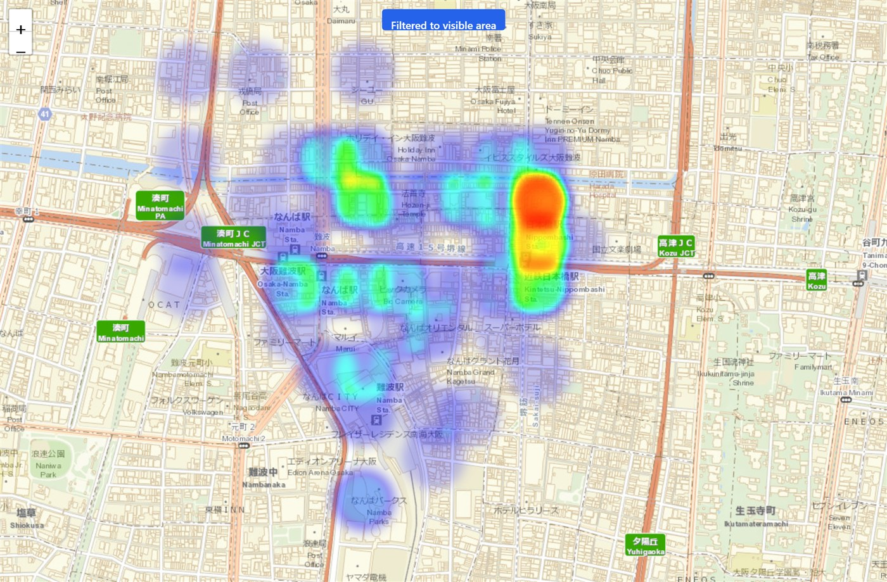

# TraceMap

[](https://github.com/adriantimoteo/trace-map/actions/workflows/ci.yml)
[](https://github.com/adriantimoteo/trace-map/actions/workflows/deploy.yml)

**[Try it live](https://adriantimoteo.github.io/trace-map/)** — no install needed.

TraceMap turns a Google Takeout location history export into an interactive heatmap you can explore, filter, and export — entirely in your browser.

**Your data never leaves your machine.** There is no backend, no upload, and no network request involving your location data. Parsing, filtering, and rendering all happen client-side, in a Web Worker.



## Features

- **Drag-and-drop upload** of a Google Takeout `Records.json` or `Timeline.json` export, parsed off the main thread with live progress reporting
- **Format auto-detection** between the legacy Records format and the newer semantic Timeline format
- **Interactive heatmap** (Leaflet + leaflet.heat) with adjustable radius and intensity, log-scale density weighting, and percentile-based hotspot smoothing so a handful of outlier locations don't wash out the rest of the map
- **Filtering** by date range (with presets), velocity/speed threshold (to drop GPS noise from vehicle travel), and current map viewport
- **PNG export** of the current map view, including basemap attribution
- **Latin-script map labels** worldwide (Esri World Street Map basemap), so place names outside English-speaking regions stay legible
- **Live point counter** and sampling notice so you always know how much of your data is being rendered
- Re-upload a new file at any time without reloading the app

## Getting started

```bash
npm install
npm run dev
```

Then open the printed local URL and drop in a `Records.json` or `Timeline.json` file from your Google location history export (see below).

### Exporting your Google Timeline data

Google has changed how Timeline (formerly "Location History") is exported more than once, so which path applies depends on your account and device:

- **Via Google Takeout** (older accounts, or Timeline still backed up to your Google Account): go to [takeout.google.com](https://takeout.google.com/), click **Deselect all**, then select **Location History (Timeline)**, and export. Your download contains a `Records.json` file.
- **Via the Settings app** (Timeline stored on-device, the current default for most Android users): open the **Settings** app → **Location** → **Location services** → **Timeline** → **Export Timeline data** → **Continue** → choose a storage location → **Save**. This produces a `Timeline.json` file.

See Google's [Timeline export/delete help article](https://support.google.com/maps/answer/14169818) if the exact menu differs from the above — Google updates this UI periodically.

TraceMap auto-detects which format you drop in, so either file works without configuration.

### Don't have an export handy?

Generate a synthetic dataset for local testing:

```bash
npm run generate-data
```

## Scripts

| Command | Description |
| --- | --- |
| `npm run dev` | Start the Vite dev server |
| `npm run build` | Type-check and build for production |
| `npm run preview` | Preview the production build locally |
| `npm test` | Run the test suite (Vitest) |
| `npm run test:coverage` | Run tests with coverage |
| `npm run lint` | Lint the codebase |
| `npm run type-check` | Type-check without emitting |
| `npm run format` / `format:check` | Format / check formatting with Prettier |
| `npm run generate-data` | Generate a synthetic location history file for local testing |
| `npm run audit:deps` | Audit dependencies against the project's blocklist |

## Tech stack

React 18 + TypeScript, Vite, Tailwind CSS, Leaflet/react-leaflet with leaflet.heat, a Web Worker for streaming JSON parsing (`@streamparser/json`), and html2canvas for PNG export. Tested with Vitest and React Testing Library.

## Privacy

TraceMap is designed to run entirely client-side. Location data is read from the file you select, processed in your browser, and never transmitted anywhere. Closing the tab discards it.

## Deployment

Pushes to `main` build and deploy automatically to GitHub Pages via `.github/workflows/deploy.yml`. To host your own fork: in the repo's **Settings → Pages**, set **Source** to **GitHub Actions** — the workflow handles the rest. The build uses a relative `base` path (`vite.config.ts`) so it works unmodified at any GitHub Pages subpath.

## Status

TraceMap is under active development. The v1 desktop experience (upload → filter → export) is live and publicly hosted; a dedicated onboarding flow and further v2 polish are planned as a follow-on.
